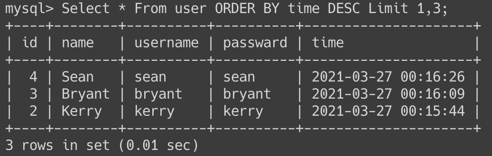

## 3-1
```
INSERT INTO user (name, username, passward) VALUES ("Steven", "ply", "ply");
```

## 3-2
```
SELECT * FROM user;
```

## 3-3
```
SELECT COUNT(*) FROM user;
```

## 3-4
```
SELECT * FROM user ORDER BY time DESC;
```

## 3-5
```
Select * From user ORDER BY time DESC Limit 1,3;
```

## 3-6
```
SELECT * FROM user WHERE username = 'ply';
```

## 3-7
```
SELECT * FROM user WHERE username = 'ply' AND passward = 'ply';
```

## 3-8
```
UPDATE user SET name = '丁滿' WHERE username = 'ply';
```

## 3-9
```
DROP TABLE user;
```
## 4-1
```
SELECT message.content, user.name FROM message INNER JOIN user ON message.user_id = user.id;
```

## 4-2
```
SELECT message.content, user.name FROM message INNER JOIN user ON message.user_id = user.id WHERE user.username = 'ply';
```
